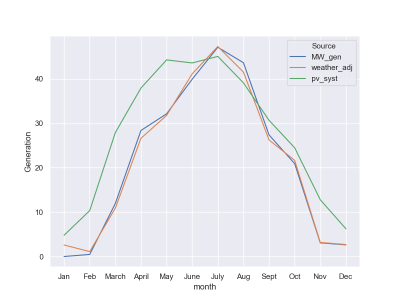
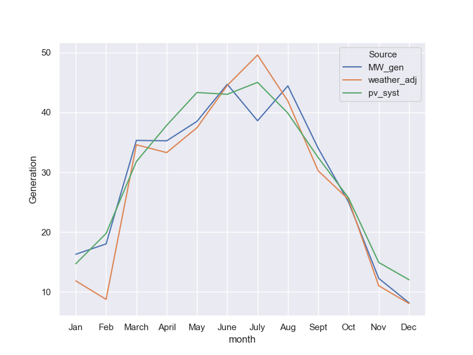

<!DOCTYPE html>
<html lang="en">
    <head>
        <meta charset="UTF-8">
        <title>
            Model Report
        </title>
    </head>

    <body>
        <h1>Model Report</h1>
        
This report was automatically generated

        
            <h2>Belle River - Model Results</h2>

Monthly Generation Results <i>'Belle River'</i>, as captured in file<i>'Belle River.csv'</i>.

<table border="1" class="dataframe">
  <thead>
    <tr style="text-align: right;">
      <th></th>
      <th>plant_id</th>
      <th>month</th>
      <th>year</th>
      <th>Source</th>
      <th>Generation</th>
    </tr>
  </thead>
  <tbody>
    <tr>
      <th>900</th>
      <td>1</td>
      <td>1</td>
      <td>2020</td>
      <td>MW_gen</td>
      <td>12.97</td>
    </tr>
    <tr>
      <th>963</th>
      <td>1</td>
      <td>2</td>
      <td>2020</td>
      <td>MW_gen</td>
      <td>22.67</td>
    </tr>
    <tr>
      <th>1972</th>
      <td>1</td>
      <td>1</td>
      <td>2020</td>
      <td>weather_adj</td>
      <td>16.50</td>
    </tr>
    <tr>
      <th>2035</th>
      <td>1</td>
      <td>2</td>
      <td>2020</td>
      <td>weather_adj</td>
      <td>NaN</td>
    </tr>
    <tr>
      <th>3044</th>
      <td>1</td>
      <td>1</td>
      <td>2020</td>
      <td>pv_syst</td>
      <td>13.46</td>
    </tr>
    <tr>
      <th>3107</th>
      <td>1</td>
      <td>2</td>
      <td>2020</td>
      <td>pv_syst</td>
      <td>14.59</td>
    </tr>
  </tbody>
</table>
        
            <h2>Renfrew - Model Results</h2>

Monthly Generation Results <i>'Renfrew'</i>, as captured in file<i>'Renfrew.csv'</i>.

<table border="1" class="dataframe">
  <thead>
    <tr style="text-align: right;">
      <th></th>
      <th>plant_id</th>
      <th>month</th>
      <th>year</th>
      <th>Source</th>
      <th>Generation</th>
    </tr>
  </thead>
  <tbody>
    <tr>
      <th>901</th>
      <td>2</td>
      <td>1</td>
      <td>2020</td>
      <td>MW_gen</td>
      <td>1.50</td>
    </tr>
    <tr>
      <th>964</th>
      <td>2</td>
      <td>2</td>
      <td>2020</td>
      <td>MW_gen</td>
      <td>0.39</td>
    </tr>
    <tr>
      <th>1973</th>
      <td>2</td>
      <td>1</td>
      <td>2020</td>
      <td>weather_adj</td>
      <td>15.50</td>
    </tr>
    <tr>
      <th>2036</th>
      <td>2</td>
      <td>2</td>
      <td>2020</td>
      <td>weather_adj</td>
      <td>NaN</td>
    </tr>
    <tr>
      <th>3045</th>
      <td>2</td>
      <td>1</td>
      <td>2020</td>
      <td>pv_syst</td>
      <td>14.03</td>
    </tr>
    <tr>
      <th>3108</th>
      <td>2</td>
      <td>2</td>
      <td>2020</td>
      <td>pv_syst</td>
      <td>19.59</td>
    </tr>
  </tbody>
</table>
        
            <h2>Earlton - Model Results</h2>

Monthly Generation Results <i>'Earlton'</i>, as captured in file<i>'Earlton.csv'</i>.

<table border="1" class="dataframe">
  <thead>
    <tr style="text-align: right;">
      <th></th>
      <th>plant_id</th>
      <th>month</th>
      <th>year</th>
      <th>Source</th>
      <th>Generation</th>
    </tr>
  </thead>
  <tbody>
    <tr>
      <th>902</th>
      <td>3</td>
      <td>1</td>
      <td>2020</td>
      <td>MW_gen</td>
      <td>1.39</td>
    </tr>
    <tr>
      <th>965</th>
      <td>3</td>
      <td>2</td>
      <td>2020</td>
      <td>MW_gen</td>
      <td>5.96</td>
    </tr>
    <tr>
      <th>1974</th>
      <td>3</td>
      <td>1</td>
      <td>2020</td>
      <td>weather_adj</td>
      <td>1.69</td>
    </tr>
    <tr>
      <th>2037</th>
      <td>3</td>
      <td>2</td>
      <td>2020</td>
      <td>weather_adj</td>
      <td>NaN</td>
    </tr>
    <tr>
      <th>3046</th>
      <td>3</td>
      <td>1</td>
      <td>2020</td>
      <td>pv_syst</td>
      <td>14.12</td>
    </tr>
    <tr>
      <th>3109</th>
      <td>3</td>
      <td>2</td>
      <td>2020</td>
      <td>pv_syst</td>
      <td>19.84</td>
    </tr>
  </tbody>
</table>
        
            <h2>Verner - Model Results</h2>

Monthly Generation Results <i>'Verner'</i>, as captured in file<i>'Verner.csv'</i>.

<table border="1" class="dataframe">
  <thead>
    <tr style="text-align: right;">
      <th></th>
      <th>plant_id</th>
      <th>month</th>
      <th>year</th>
      <th>Source</th>
      <th>Generation</th>
    </tr>
  </thead>
  <tbody>
    <tr>
      <th>903</th>
      <td>4</td>
      <td>1</td>
      <td>2020</td>
      <td>MW_gen</td>
      <td>6.45</td>
    </tr>
    <tr>
      <th>966</th>
      <td>4</td>
      <td>2</td>
      <td>2020</td>
      <td>MW_gen</td>
      <td>22.00</td>
    </tr>
    <tr>
      <th>1975</th>
      <td>4</td>
      <td>1</td>
      <td>2020</td>
      <td>weather_adj</td>
      <td>19.89</td>
    </tr>
    <tr>
      <th>2038</th>
      <td>4</td>
      <td>2</td>
      <td>2020</td>
      <td>weather_adj</td>
      <td>NaN</td>
    </tr>
    <tr>
      <th>3047</th>
      <td>4</td>
      <td>1</td>
      <td>2020</td>
      <td>pv_syst</td>
      <td>8.56</td>
    </tr>
    <tr>
      <th>3110</th>
      <td>4</td>
      <td>2</td>
      <td>2020</td>
      <td>pv_syst</td>
      <td>13.81</td>
    </tr>
  </tbody>
</table>
        
            <h2>Kearney - Model Results</h2>

Monthly Generation Results <i>'Kearney'</i>, as captured in file<i>'Kearney.csv'</i>.

<table border="1" class="dataframe">
  <thead>
    <tr style="text-align: right;">
      <th></th>
      <th>plant_id</th>
      <th>month</th>
      <th>year</th>
      <th>Source</th>
      <th>Generation</th>
    </tr>
  </thead>
  <tbody>
    <tr>
      <th>904</th>
      <td>5</td>
      <td>1</td>
      <td>2020</td>
      <td>MW_gen</td>
      <td>0.810</td>
    </tr>
    <tr>
      <th>967</th>
      <td>5</td>
      <td>2</td>
      <td>2020</td>
      <td>MW_gen</td>
      <td>0.274</td>
    </tr>
    <tr>
      <th>1976</th>
      <td>5</td>
      <td>1</td>
      <td>2020</td>
      <td>weather_adj</td>
      <td>6.970</td>
    </tr>
    <tr>
      <th>2039</th>
      <td>5</td>
      <td>2</td>
      <td>2020</td>
      <td>weather_adj</td>
      <td>NaN</td>
    </tr>
    <tr>
      <th>3048</th>
      <td>5</td>
      <td>1</td>
      <td>2020</td>
      <td>pv_syst</td>
      <td>4.800</td>
    </tr>
    <tr>
      <th>3111</th>
      <td>5</td>
      <td>2</td>
      <td>2020</td>
      <td>pv_syst</td>
      <td>10.340</td>
    </tr>
  </tbody>
</table>
        
            <h2>Sturgeon Falls - Model Results</h2>

Monthly Generation Results <i>'Sturgeon Falls'</i>, as captured in file<i>'Sturgeon Falls.csv'</i>.

<table border="1" class="dataframe">
  <thead>
    <tr style="text-align: right;">
      <th></th>
      <th>plant_id</th>
      <th>month</th>
      <th>year</th>
      <th>Source</th>
      <th>Generation</th>
    </tr>
  </thead>
  <tbody>
    <tr>
      <th>905</th>
      <td>6</td>
      <td>1</td>
      <td>2020</td>
      <td>MW_gen</td>
      <td>2.15</td>
    </tr>
    <tr>
      <th>968</th>
      <td>6</td>
      <td>2</td>
      <td>2020</td>
      <td>MW_gen</td>
      <td>8.81</td>
    </tr>
    <tr>
      <th>1977</th>
      <td>6</td>
      <td>1</td>
      <td>2020</td>
      <td>weather_adj</td>
      <td>19.04</td>
    </tr>
    <tr>
      <th>2040</th>
      <td>6</td>
      <td>2</td>
      <td>2020</td>
      <td>weather_adj</td>
      <td>NaN</td>
    </tr>
    <tr>
      <th>3049</th>
      <td>6</td>
      <td>1</td>
      <td>2020</td>
      <td>pv_syst</td>
      <td>8.40</td>
    </tr>
    <tr>
      <th>3112</th>
      <td>6</td>
      <td>2</td>
      <td>2020</td>
      <td>pv_syst</td>
      <td>13.35</td>
    </tr>
  </tbody>
</table>
        
            <h2>Simcoe - Model Results</h2>

Monthly Generation Results <i>'Simcoe'</i>, as captured in file<i>'Simcoe.csv'</i>.

<table border="1" class="dataframe">
  <thead>
    <tr style="text-align: right;">
      <th></th>
      <th>plant_id</th>
      <th>month</th>
      <th>year</th>
      <th>Source</th>
      <th>Generation</th>
    </tr>
  </thead>
  <tbody>
    <tr>
      <th>906</th>
      <td>7</td>
      <td>1</td>
      <td>2020</td>
      <td>MW_gen</td>
      <td>12.48</td>
    </tr>
    <tr>
      <th>969</th>
      <td>7</td>
      <td>2</td>
      <td>2020</td>
      <td>MW_gen</td>
      <td>21.33</td>
    </tr>
    <tr>
      <th>1978</th>
      <td>7</td>
      <td>1</td>
      <td>2020</td>
      <td>weather_adj</td>
      <td>16.35</td>
    </tr>
    <tr>
      <th>2041</th>
      <td>7</td>
      <td>2</td>
      <td>2020</td>
      <td>weather_adj</td>
      <td>NaN</td>
    </tr>
    <tr>
      <th>3050</th>
      <td>7</td>
      <td>1</td>
      <td>2020</td>
      <td>pv_syst</td>
      <td>14.77</td>
    </tr>
    <tr>
      <th>3113</th>
      <td>7</td>
      <td>2</td>
      <td>2020</td>
      <td>pv_syst</td>
      <td>19.72</td>
    </tr>
  </tbody>
</table>
        
            <h2>Newburgh - Model Results</h2>

Monthly Generation Results <i>'Newburgh'</i>, as captured in file<i>'Newburgh.csv'</i>.

<table border="1" class="dataframe">
  <thead>
    <tr style="text-align: right;">
      <th></th>
      <th>plant_id</th>
      <th>month</th>
      <th>year</th>
      <th>Source</th>
      <th>Generation</th>
    </tr>
  </thead>
  <tbody>
    <tr>
      <th>907</th>
      <td>8</td>
      <td>1</td>
      <td>2020</td>
      <td>MW_gen</td>
      <td>5.01</td>
    </tr>
    <tr>
      <th>970</th>
      <td>8</td>
      <td>2</td>
      <td>2020</td>
      <td>MW_gen</td>
      <td>19.00</td>
    </tr>
    <tr>
      <th>1979</th>
      <td>8</td>
      <td>1</td>
      <td>2020</td>
      <td>weather_adj</td>
      <td>13.80</td>
    </tr>
    <tr>
      <th>2042</th>
      <td>8</td>
      <td>2</td>
      <td>2020</td>
      <td>weather_adj</td>
      <td>NaN</td>
    </tr>
    <tr>
      <th>3051</th>
      <td>8</td>
      <td>1</td>
      <td>2020</td>
      <td>pv_syst</td>
      <td>12.78</td>
    </tr>
    <tr>
      <th>3114</th>
      <td>8</td>
      <td>2</td>
      <td>2020</td>
      <td>pv_syst</td>
      <td>18.92</td>
    </tr>
  </tbody>
</table>
        
            <h2>Tecumseh - Model Results</h2>

Monthly Generation Results <i>'Tecumseh'</i>, as captured in file<i>'Tecumseh.csv'</i>.

<table border="1" class="dataframe">
  <thead>
    <tr style="text-align: right;">
      <th></th>
      <th>plant_id</th>
      <th>month</th>
      <th>year</th>
      <th>Source</th>
      <th>Generation</th>
    </tr>
  </thead>
  <tbody>
    <tr>
      <th>908</th>
      <td>9</td>
      <td>1</td>
      <td>2020</td>
      <td>MW_gen</td>
      <td>13.54</td>
    </tr>
    <tr>
      <th>971</th>
      <td>9</td>
      <td>2</td>
      <td>2020</td>
      <td>MW_gen</td>
      <td>22.49</td>
    </tr>
    <tr>
      <th>1980</th>
      <td>9</td>
      <td>1</td>
      <td>2020</td>
      <td>weather_adj</td>
      <td>14.14</td>
    </tr>
    <tr>
      <th>2043</th>
      <td>9</td>
      <td>2</td>
      <td>2020</td>
      <td>weather_adj</td>
      <td>NaN</td>
    </tr>
    <tr>
      <th>3052</th>
      <td>9</td>
      <td>1</td>
      <td>2020</td>
      <td>pv_syst</td>
      <td>13.60</td>
    </tr>
    <tr>
      <th>3115</th>
      <td>9</td>
      <td>2</td>
      <td>2020</td>
      <td>pv_syst</td>
      <td>15.86</td>
    </tr>
  </tbody>
</table>
        
            <h2>Oldcastle - Model Results</h2>

Monthly Generation Results <i>'Oldcastle'</i>, as captured in file<i>'Oldcastle.csv'</i>.

<table border="1" class="dataframe">
  <thead>
    <tr style="text-align: right;">
      <th></th>
      <th>plant_id</th>
      <th>month</th>
      <th>year</th>
      <th>Source</th>
      <th>Generation</th>
    </tr>
  </thead>
  <tbody>
    <tr>
      <th>909</th>
      <td>10</td>
      <td>1</td>
      <td>2020</td>
      <td>MW_gen</td>
      <td>12.93</td>
    </tr>
    <tr>
      <th>972</th>
      <td>10</td>
      <td>2</td>
      <td>2020</td>
      <td>MW_gen</td>
      <td>22.61</td>
    </tr>
    <tr>
      <th>1981</th>
      <td>10</td>
      <td>1</td>
      <td>2020</td>
      <td>weather_adj</td>
      <td>13.66</td>
    </tr>
    <tr>
      <th>2044</th>
      <td>10</td>
      <td>2</td>
      <td>2020</td>
      <td>weather_adj</td>
      <td>NaN</td>
    </tr>
    <tr>
      <th>3053</th>
      <td>10</td>
      <td>1</td>
      <td>2020</td>
      <td>pv_syst</td>
      <td>13.06</td>
    </tr>
    <tr>
      <th>3116</th>
      <td>10</td>
      <td>2</td>
      <td>2020</td>
      <td>pv_syst</td>
      <td>15.34</td>
    </tr>
  </tbody>
</table>
        
            <h2>Waterford - Model Results</h2>

Monthly Generation Results <i>'Waterford'</i>, as captured in file<i>'Waterford.csv'</i>.

<table border="1" class="dataframe">
  <thead>
    <tr style="text-align: right;">
      <th></th>
      <th>plant_id</th>
      <th>month</th>
      <th>year</th>
      <th>Source</th>
      <th>Generation</th>
    </tr>
  </thead>
  <tbody>
    <tr>
      <th>910</th>
      <td>11</td>
      <td>1</td>
      <td>2020</td>
      <td>MW_gen</td>
      <td>8.83</td>
    </tr>
    <tr>
      <th>973</th>
      <td>11</td>
      <td>2</td>
      <td>2020</td>
      <td>MW_gen</td>
      <td>20.52</td>
    </tr>
    <tr>
      <th>1982</th>
      <td>11</td>
      <td>1</td>
      <td>2020</td>
      <td>weather_adj</td>
      <td>16.31</td>
    </tr>
    <tr>
      <th>2045</th>
      <td>11</td>
      <td>2</td>
      <td>2020</td>
      <td>weather_adj</td>
      <td>NaN</td>
    </tr>
    <tr>
      <th>3054</th>
      <td>11</td>
      <td>1</td>
      <td>2020</td>
      <td>pv_syst</td>
      <td>14.82</td>
    </tr>
    <tr>
      <th>3117</th>
      <td>11</td>
      <td>2</td>
      <td>2020</td>
      <td>pv_syst</td>
      <td>20.19</td>
    </tr>
  </tbody>
</table>
        
            <h2>Pontypool - Model Results</h2>

Monthly Generation Results <i>'Pontypool'</i>, as captured in file<i>'Pontypool.csv'</i>.

<table border="1" class="dataframe">
  <thead>
    <tr style="text-align: right;">
      <th></th>
      <th>plant_id</th>
      <th>month</th>
      <th>year</th>
      <th>Source</th>
      <th>Generation</th>
    </tr>
  </thead>
  <tbody>
    <tr>
      <th>911</th>
      <td>12</td>
      <td>1</td>
      <td>2020</td>
      <td>MW_gen</td>
      <td>6.95</td>
    </tr>
    <tr>
      <th>974</th>
      <td>12</td>
      <td>2</td>
      <td>2020</td>
      <td>MW_gen</td>
      <td>18.10</td>
    </tr>
    <tr>
      <th>1983</th>
      <td>12</td>
      <td>1</td>
      <td>2020</td>
      <td>weather_adj</td>
      <td>18.72</td>
    </tr>
    <tr>
      <th>2046</th>
      <td>12</td>
      <td>2</td>
      <td>2020</td>
      <td>weather_adj</td>
      <td>NaN</td>
    </tr>
    <tr>
      <th>3055</th>
      <td>12</td>
      <td>1</td>
      <td>2020</td>
      <td>pv_syst</td>
      <td>11.52</td>
    </tr>
    <tr>
      <th>3118</th>
      <td>12</td>
      <td>2</td>
      <td>2020</td>
      <td>pv_syst</td>
      <td>17.17</td>
    </tr>
  </tbody>
</table>
        
            <h2>Thunder Bay - Model Results</h2>

Monthly Generation Results <i>'Thunder Bay'</i>, as captured in file<i>'Thunder Bay.csv'</i>.

<table border="1" class="dataframe">
  <thead>
    <tr style="text-align: right;">
      <th></th>
      <th>plant_id</th>
      <th>month</th>
      <th>year</th>
      <th>Source</th>
      <th>Generation</th>
    </tr>
  </thead>
  <tbody>
    <tr>
      <th>912</th>
      <td>13</td>
      <td>1</td>
      <td>2020</td>
      <td>MW_gen</td>
      <td>3.12</td>
    </tr>
    <tr>
      <th>975</th>
      <td>13</td>
      <td>2</td>
      <td>2020</td>
      <td>MW_gen</td>
      <td>14.96</td>
    </tr>
    <tr>
      <th>1984</th>
      <td>13</td>
      <td>1</td>
      <td>2020</td>
      <td>weather_adj</td>
      <td>19.07</td>
    </tr>
    <tr>
      <th>2047</th>
      <td>13</td>
      <td>2</td>
      <td>2020</td>
      <td>weather_adj</td>
      <td>NaN</td>
    </tr>
    <tr>
      <th>3056</th>
      <td>13</td>
      <td>1</td>
      <td>2020</td>
      <td>pv_syst</td>
      <td>10.86</td>
    </tr>
    <tr>
      <th>3119</th>
      <td>13</td>
      <td>2</td>
      <td>2020</td>
      <td>pv_syst</td>
      <td>21.20</td>
    </tr>
  </tbody>
</table>
        
            <h2>Cache Bay - Model Results</h2>

Monthly Generation Results <i>'Cache Bay'</i>, as captured in file<i>'Cache Bay.csv'</i>.

<table border="1" class="dataframe">
  <thead>
    <tr style="text-align: right;">
      <th></th>
      <th>plant_id</th>
      <th>month</th>
      <th>year</th>
      <th>Source</th>
      <th>Generation</th>
    </tr>
  </thead>
  <tbody>
    <tr>
      <th>913</th>
      <td>14</td>
      <td>1</td>
      <td>2020</td>
      <td>MW_gen</td>
      <td>1.35</td>
    </tr>
    <tr>
      <th>976</th>
      <td>14</td>
      <td>2</td>
      <td>2020</td>
      <td>MW_gen</td>
      <td>5.32</td>
    </tr>
    <tr>
      <th>1985</th>
      <td>14</td>
      <td>1</td>
      <td>2020</td>
      <td>weather_adj</td>
      <td>18.46</td>
    </tr>
    <tr>
      <th>2048</th>
      <td>14</td>
      <td>2</td>
      <td>2020</td>
      <td>weather_adj</td>
      <td>NaN</td>
    </tr>
    <tr>
      <th>3057</th>
      <td>14</td>
      <td>1</td>
      <td>2020</td>
      <td>pv_syst</td>
      <td>8.37</td>
    </tr>
    <tr>
      <th>3120</th>
      <td>14</td>
      <td>2</td>
      <td>2020</td>
      <td>pv_syst</td>
      <td>13.94</td>
    </tr>
  </tbody>
</table>
        
            <h2>Thomasburg - Model Results</h2>

Monthly Generation Results <i>'Thomasburg'</i>, as captured in file<i>'Thomasburg.csv'</i>.

<table border="1" class="dataframe">
  <thead>
    <tr style="text-align: right;">
      <th></th>
      <th>plant_id</th>
      <th>month</th>
      <th>year</th>
      <th>Source</th>
      <th>Generation</th>
    </tr>
  </thead>
  <tbody>
    <tr>
      <th>914</th>
      <td>15</td>
      <td>1</td>
      <td>2020</td>
      <td>MW_gen</td>
      <td>5.84</td>
    </tr>
    <tr>
      <th>977</th>
      <td>15</td>
      <td>2</td>
      <td>2020</td>
      <td>MW_gen</td>
      <td>17.12</td>
    </tr>
    <tr>
      <th>1986</th>
      <td>15</td>
      <td>1</td>
      <td>2020</td>
      <td>weather_adj</td>
      <td>15.46</td>
    </tr>
    <tr>
      <th>2049</th>
      <td>15</td>
      <td>2</td>
      <td>2020</td>
      <td>weather_adj</td>
      <td>NaN</td>
    </tr>
    <tr>
      <th>3058</th>
      <td>15</td>
      <td>1</td>
      <td>2020</td>
      <td>pv_syst</td>
      <td>14.70</td>
    </tr>
    <tr>
      <th>3121</th>
      <td>15</td>
      <td>2</td>
      <td>2020</td>
      <td>pv_syst</td>
      <td>19.76</td>
    </tr>
  </tbody>
</table>
        
            <h2>Brockville - Model Results</h2>

Monthly Generation Results <i>'Brockville'</i>, as captured in file<i>'Brockville.csv'</i>.

<table border="1" class="dataframe">
  <thead>
    <tr style="text-align: right;">
      <th></th>
      <th>plant_id</th>
      <th>month</th>
      <th>year</th>
      <th>Source</th>
      <th>Generation</th>
    </tr>
  </thead>
  <tbody>
    <tr>
      <th>915</th>
      <td>16</td>
      <td>1</td>
      <td>2020</td>
      <td>MW_gen</td>
      <td>2.99</td>
    </tr>
    <tr>
      <th>978</th>
      <td>16</td>
      <td>2</td>
      <td>2020</td>
      <td>MW_gen</td>
      <td>10.26</td>
    </tr>
    <tr>
      <th>1987</th>
      <td>16</td>
      <td>1</td>
      <td>2020</td>
      <td>weather_adj</td>
      <td>14.81</td>
    </tr>
    <tr>
      <th>2050</th>
      <td>16</td>
      <td>2</td>
      <td>2020</td>
      <td>weather_adj</td>
      <td>NaN</td>
    </tr>
    <tr>
      <th>3059</th>
      <td>16</td>
      <td>1</td>
      <td>2020</td>
      <td>pv_syst</td>
      <td>12.35</td>
    </tr>
    <tr>
      <th>3122</th>
      <td>16</td>
      <td>2</td>
      <td>2020</td>
      <td>pv_syst</td>
      <td>17.22</td>
    </tr>
  </tbody>
</table>
        
            <h2>Dundalk - Model Results</h2>

Monthly Generation Results <i>'Dundalk'</i>, as captured in file<i>'Dundalk.csv'</i>.

<table border="1" class="dataframe">
  <thead>
    <tr style="text-align: right;">
      <th></th>
      <th>plant_id</th>
      <th>month</th>
      <th>year</th>
      <th>Source</th>
      <th>Generation</th>
    </tr>
  </thead>
  <tbody>
    <tr>
      <th>916</th>
      <td>17</td>
      <td>1</td>
      <td>2020</td>
      <td>MW_gen</td>
      <td>3.55</td>
    </tr>
    <tr>
      <th>979</th>
      <td>17</td>
      <td>2</td>
      <td>2020</td>
      <td>MW_gen</td>
      <td>19.57</td>
    </tr>
    <tr>
      <th>1988</th>
      <td>17</td>
      <td>1</td>
      <td>2020</td>
      <td>weather_adj</td>
      <td>18.62</td>
    </tr>
    <tr>
      <th>2051</th>
      <td>17</td>
      <td>2</td>
      <td>2020</td>
      <td>weather_adj</td>
      <td>NaN</td>
    </tr>
    <tr>
      <th>3060</th>
      <td>17</td>
      <td>1</td>
      <td>2020</td>
      <td>pv_syst</td>
      <td>3.34</td>
    </tr>
    <tr>
      <th>3123</th>
      <td>17</td>
      <td>2</td>
      <td>2020</td>
      <td>pv_syst</td>
      <td>11.05</td>
    </tr>
  </tbody>
</table>
        
            <h2>McDonalds Corners - Model Results</h2>

Monthly Generation Results <i>'McDonalds Corners'</i>, as captured in file<i>'McDonalds Corners.csv'</i>.

<table border="1" class="dataframe">
  <thead>
    <tr style="text-align: right;">
      <th></th>
      <th>plant_id</th>
      <th>month</th>
      <th>year</th>
      <th>Source</th>
      <th>Generation</th>
    </tr>
  </thead>
  <tbody>
    <tr>
      <th>917</th>
      <td>18</td>
      <td>1</td>
      <td>2020</td>
      <td>MW_gen</td>
      <td>0.59</td>
    </tr>
    <tr>
      <th>980</th>
      <td>18</td>
      <td>2</td>
      <td>2020</td>
      <td>MW_gen</td>
      <td>0.82</td>
    </tr>
    <tr>
      <th>1989</th>
      <td>18</td>
      <td>1</td>
      <td>2020</td>
      <td>weather_adj</td>
      <td>9.65</td>
    </tr>
    <tr>
      <th>2052</th>
      <td>18</td>
      <td>2</td>
      <td>2020</td>
      <td>weather_adj</td>
      <td>NaN</td>
    </tr>
    <tr>
      <th>3061</th>
      <td>18</td>
      <td>1</td>
      <td>2020</td>
      <td>pv_syst</td>
      <td>11.91</td>
    </tr>
    <tr>
      <th>3124</th>
      <td>18</td>
      <td>2</td>
      <td>2020</td>
      <td>pv_syst</td>
      <td>18.79</td>
    </tr>
  </tbody>
</table>
        
            <h2>100 King - Model Results</h2>

Monthly Generation Results <i>'100 King'</i>, as captured in file<i>'100 King.csv'</i>.

<table border="1" class="dataframe">
  <thead>
    <tr style="text-align: right;">
      <th></th>
      <th>plant_id</th>
      <th>month</th>
      <th>year</th>
      <th>Source</th>
      <th>Generation</th>
    </tr>
  </thead>
  <tbody>
    <tr>
      <th>918</th>
      <td>19</td>
      <td>1</td>
      <td>2020</td>
      <td>MW_gen</td>
      <td>15.88</td>
    </tr>
    <tr>
      <th>981</th>
      <td>19</td>
      <td>2</td>
      <td>2020</td>
      <td>MW_gen</td>
      <td>32.47</td>
    </tr>
    <tr>
      <th>1990</th>
      <td>19</td>
      <td>1</td>
      <td>2020</td>
      <td>weather_adj</td>
      <td>16.58</td>
    </tr>
    <tr>
      <th>2053</th>
      <td>19</td>
      <td>2</td>
      <td>2020</td>
      <td>weather_adj</td>
      <td>NaN</td>
    </tr>
    <tr>
      <th>3062</th>
      <td>19</td>
      <td>1</td>
      <td>2020</td>
      <td>pv_syst</td>
      <td>18.90</td>
    </tr>
    <tr>
      <th>3125</th>
      <td>19</td>
      <td>2</td>
      <td>2020</td>
      <td>pv_syst</td>
      <td>27.15</td>
    </tr>
  </tbody>
</table>
        
            <h2>102 Arnold - Model Results</h2>

Monthly Generation Results <i>'102 Arnold'</i>, as captured in file<i>'102 Arnold.csv'</i>.

<table border="1" class="dataframe">
  <thead>
    <tr style="text-align: right;">
      <th></th>
      <th>plant_id</th>
      <th>month</th>
      <th>year</th>
      <th>Source</th>
      <th>Generation</th>
    </tr>
  </thead>
  <tbody>
    <tr>
      <th>919</th>
      <td>20</td>
      <td>1</td>
      <td>2020</td>
      <td>MW_gen</td>
      <td>16.53</td>
    </tr>
    <tr>
      <th>982</th>
      <td>20</td>
      <td>2</td>
      <td>2020</td>
      <td>MW_gen</td>
      <td>31.50</td>
    </tr>
    <tr>
      <th>1991</th>
      <td>20</td>
      <td>1</td>
      <td>2020</td>
      <td>weather_adj</td>
      <td>23.34</td>
    </tr>
    <tr>
      <th>2054</th>
      <td>20</td>
      <td>2</td>
      <td>2020</td>
      <td>weather_adj</td>
      <td>NaN</td>
    </tr>
    <tr>
      <th>3063</th>
      <td>20</td>
      <td>1</td>
      <td>2020</td>
      <td>pv_syst</td>
      <td>14.57</td>
    </tr>
    <tr>
      <th>3126</th>
      <td>20</td>
      <td>2</td>
      <td>2020</td>
      <td>pv_syst</td>
      <td>19.00</td>
    </tr>
  </tbody>
</table>
        
            <h2>110 Arnold - Model Results</h2>

Monthly Generation Results <i>'110 Arnold'</i>, as captured in file<i>'110 Arnold.csv'</i>.

<table border="1" class="dataframe">
  <thead>
    <tr style="text-align: right;">
      <th></th>
      <th>plant_id</th>
      <th>month</th>
      <th>year</th>
      <th>Source</th>
      <th>Generation</th>
    </tr>
  </thead>
  <tbody>
    <tr>
      <th>920</th>
      <td>21</td>
      <td>1</td>
      <td>2020</td>
      <td>MW_gen</td>
      <td>10.09</td>
    </tr>
    <tr>
      <th>983</th>
      <td>21</td>
      <td>2</td>
      <td>2020</td>
      <td>MW_gen</td>
      <td>19.54</td>
    </tr>
    <tr>
      <th>1992</th>
      <td>21</td>
      <td>1</td>
      <td>2020</td>
      <td>weather_adj</td>
      <td>14.46</td>
    </tr>
    <tr>
      <th>2055</th>
      <td>21</td>
      <td>2</td>
      <td>2020</td>
      <td>weather_adj</td>
      <td>NaN</td>
    </tr>
    <tr>
      <th>3064</th>
      <td>21</td>
      <td>1</td>
      <td>2020</td>
      <td>pv_syst</td>
      <td>9.00</td>
    </tr>
    <tr>
      <th>3127</th>
      <td>21</td>
      <td>2</td>
      <td>2020</td>
      <td>pv_syst</td>
      <td>11.90</td>
    </tr>
  </tbody>
</table>
        
            <h2>28 Mill - Model Results</h2>

Monthly Generation Results <i>'28 Mill'</i>, as captured in file<i>'28 Mill.csv'</i>.

<table border="1" class="dataframe">
  <thead>
    <tr style="text-align: right;">
      <th></th>
      <th>plant_id</th>
      <th>month</th>
      <th>year</th>
      <th>Source</th>
      <th>Generation</th>
    </tr>
  </thead>
  <tbody>
    <tr>
      <th>921</th>
      <td>22</td>
      <td>1</td>
      <td>2020</td>
      <td>MW_gen</td>
      <td>21.42</td>
    </tr>
    <tr>
      <th>984</th>
      <td>22</td>
      <td>2</td>
      <td>2020</td>
      <td>MW_gen</td>
      <td>33.98</td>
    </tr>
    <tr>
      <th>1993</th>
      <td>22</td>
      <td>1</td>
      <td>2020</td>
      <td>weather_adj</td>
      <td>20.73</td>
    </tr>
    <tr>
      <th>2056</th>
      <td>22</td>
      <td>2</td>
      <td>2020</td>
      <td>weather_adj</td>
      <td>NaN</td>
    </tr>
    <tr>
      <th>3065</th>
      <td>22</td>
      <td>1</td>
      <td>2020</td>
      <td>pv_syst</td>
      <td>16.75</td>
    </tr>
    <tr>
      <th>3128</th>
      <td>22</td>
      <td>2</td>
      <td>2020</td>
      <td>pv_syst</td>
      <td>23.93</td>
    </tr>
  </tbody>
</table>
        
            <h2>390 Thomas - Model Results</h2>

Monthly Generation Results <i>'390 Thomas'</i>, as captured in file<i>'390 Thomas.csv'</i>.

<table border="1" class="dataframe">
  <thead>
    <tr style="text-align: right;">
      <th></th>
      <th>plant_id</th>
      <th>month</th>
      <th>year</th>
      <th>Source</th>
      <th>Generation</th>
    </tr>
  </thead>
  <tbody>
    <tr>
      <th>922</th>
      <td>23</td>
      <td>1</td>
      <td>2020</td>
      <td>MW_gen</td>
      <td>13.75</td>
    </tr>
    <tr>
      <th>985</th>
      <td>23</td>
      <td>2</td>
      <td>2020</td>
      <td>MW_gen</td>
      <td>27.75</td>
    </tr>
    <tr>
      <th>1994</th>
      <td>23</td>
      <td>1</td>
      <td>2020</td>
      <td>weather_adj</td>
      <td>14.18</td>
    </tr>
    <tr>
      <th>2057</th>
      <td>23</td>
      <td>2</td>
      <td>2020</td>
      <td>weather_adj</td>
      <td>NaN</td>
    </tr>
    <tr>
      <th>3066</th>
      <td>23</td>
      <td>1</td>
      <td>2020</td>
      <td>pv_syst</td>
      <td>30.44</td>
    </tr>
    <tr>
      <th>3129</th>
      <td>23</td>
      <td>2</td>
      <td>2020</td>
      <td>pv_syst</td>
      <td>43.55</td>
    </tr>
  </tbody>
</table>
        
            <h2>462 Riverview - Model Results</h2>

Monthly Generation Results <i>'462 Riverview'</i>, as captured in file<i>'462 Riverview.csv'</i>.

<table border="1" class="dataframe">
  <thead>
    <tr style="text-align: right;">
      <th></th>
      <th>plant_id</th>
      <th>month</th>
      <th>year</th>
      <th>Source</th>
      <th>Generation</th>
    </tr>
  </thead>
  <tbody>
    <tr>
      <th>923</th>
      <td>24</td>
      <td>1</td>
      <td>2020</td>
      <td>MW_gen</td>
      <td>6.68</td>
    </tr>
    <tr>
      <th>986</th>
      <td>24</td>
      <td>2</td>
      <td>2020</td>
      <td>MW_gen</td>
      <td>10.84</td>
    </tr>
    <tr>
      <th>1995</th>
      <td>24</td>
      <td>1</td>
      <td>2020</td>
      <td>weather_adj</td>
      <td>6.95</td>
    </tr>
    <tr>
      <th>2058</th>
      <td>24</td>
      <td>2</td>
      <td>2020</td>
      <td>weather_adj</td>
      <td>NaN</td>
    </tr>
    <tr>
      <th>3067</th>
      <td>24</td>
      <td>1</td>
      <td>2020</td>
      <td>pv_syst</td>
      <td>5.28</td>
    </tr>
    <tr>
      <th>3130</th>
      <td>24</td>
      <td>2</td>
      <td>2020</td>
      <td>pv_syst</td>
      <td>8.48</td>
    </tr>
  </tbody>
</table>
        
            <h2>601 Canarctic - Model Results</h2>

Monthly Generation Results <i>'601 Canarctic'</i>, as captured in file<i>'601 Canarctic.csv'</i>.

<table border="1" class="dataframe">
  <thead>
    <tr style="text-align: right;">
      <th></th>
      <th>plant_id</th>
      <th>month</th>
      <th>year</th>
      <th>Source</th>
      <th>Generation</th>
    </tr>
  </thead>
  <tbody>
    <tr>
      <th>924</th>
      <td>25</td>
      <td>1</td>
      <td>2020</td>
      <td>MW_gen</td>
      <td>4.62</td>
    </tr>
    <tr>
      <th>987</th>
      <td>25</td>
      <td>2</td>
      <td>2020</td>
      <td>MW_gen</td>
      <td>8.69</td>
    </tr>
    <tr>
      <th>1996</th>
      <td>25</td>
      <td>1</td>
      <td>2020</td>
      <td>weather_adj</td>
      <td>4.73</td>
    </tr>
    <tr>
      <th>2059</th>
      <td>25</td>
      <td>2</td>
      <td>2020</td>
      <td>weather_adj</td>
      <td>NaN</td>
    </tr>
    <tr>
      <th>3068</th>
      <td>25</td>
      <td>1</td>
      <td>2020</td>
      <td>pv_syst</td>
      <td>6.96</td>
    </tr>
    <tr>
      <th>3131</th>
      <td>25</td>
      <td>2</td>
      <td>2020</td>
      <td>pv_syst</td>
      <td>11.27</td>
    </tr>
  </tbody>
</table>
        
            <h2>Carson Horse Arena - Model Results</h2>

Monthly Generation Results <i>'Carson Horse Arena'</i>, as captured in file<i>'Carson Horse Arena.csv'</i>.

<table border="1" class="dataframe">
  <thead>
    <tr style="text-align: right;">
      <th></th>
      <th>plant_id</th>
      <th>month</th>
      <th>year</th>
      <th>Source</th>
      <th>Generation</th>
    </tr>
  </thead>
  <tbody>
    <tr>
      <th>925</th>
      <td>26</td>
      <td>1</td>
      <td>2020</td>
      <td>MW_gen</td>
      <td>4.11</td>
    </tr>
    <tr>
      <th>994</th>
      <td>26</td>
      <td>2</td>
      <td>2020</td>
      <td>MW_gen</td>
      <td>7.93</td>
    </tr>
    <tr>
      <th>1997</th>
      <td>26</td>
      <td>1</td>
      <td>2020</td>
      <td>weather_adj</td>
      <td>4.28</td>
    </tr>
    <tr>
      <th>2066</th>
      <td>26</td>
      <td>2</td>
      <td>2020</td>
      <td>weather_adj</td>
      <td>NaN</td>
    </tr>
    <tr>
      <th>3069</th>
      <td>26</td>
      <td>1</td>
      <td>2020</td>
      <td>pv_syst</td>
      <td>4.66</td>
    </tr>
    <tr>
      <th>3138</th>
      <td>26</td>
      <td>2</td>
      <td>2020</td>
      <td>pv_syst</td>
      <td>7.29</td>
    </tr>
  </tbody>
</table>
        
            <h2>Carson Barns 4 & 6 - Model Results</h2>

Monthly Generation Results <i>'Carson Barns 4 & 6'</i>, as captured in file<i>'Carson Barns 4 & 6.csv'</i>.

<table border="1" class="dataframe">
  <thead>
    <tr style="text-align: right;">
      <th></th>
      <th>plant_id</th>
      <th>month</th>
      <th>year</th>
      <th>Source</th>
      <th>Generation</th>
    </tr>
  </thead>
  <tbody>
    <tr>
      <th>926</th>
      <td>27</td>
      <td>1</td>
      <td>2020</td>
      <td>MW_gen</td>
      <td>3.74</td>
    </tr>
    <tr>
      <th>995</th>
      <td>27</td>
      <td>2</td>
      <td>2020</td>
      <td>MW_gen</td>
      <td>7.70</td>
    </tr>
    <tr>
      <th>1998</th>
      <td>27</td>
      <td>1</td>
      <td>2020</td>
      <td>weather_adj</td>
      <td>3.69</td>
    </tr>
    <tr>
      <th>2067</th>
      <td>27</td>
      <td>2</td>
      <td>2020</td>
      <td>weather_adj</td>
      <td>NaN</td>
    </tr>
    <tr>
      <th>3070</th>
      <td>27</td>
      <td>1</td>
      <td>2020</td>
      <td>pv_syst</td>
      <td>4.02</td>
    </tr>
    <tr>
      <th>3139</th>
      <td>27</td>
      <td>2</td>
      <td>2020</td>
      <td>pv_syst</td>
      <td>6.29</td>
    </tr>
  </tbody>
</table>
        
            <h2>Carson Sales Barn - Model Results</h2>

Monthly Generation Results <i>'Carson Sales Barn'</i>, as captured in file<i>'Carson Sales Barn.csv'</i>.

<table border="1" class="dataframe">
  <thead>
    <tr style="text-align: right;">
      <th></th>
      <th>plant_id</th>
      <th>month</th>
      <th>year</th>
      <th>Source</th>
      <th>Generation</th>
    </tr>
  </thead>
  <tbody>
    <tr>
      <th>927</th>
      <td>28</td>
      <td>1</td>
      <td>2020</td>
      <td>MW_gen</td>
      <td>4.86</td>
    </tr>
    <tr>
      <th>996</th>
      <td>28</td>
      <td>2</td>
      <td>2020</td>
      <td>MW_gen</td>
      <td>11.21</td>
    </tr>
    <tr>
      <th>1999</th>
      <td>28</td>
      <td>1</td>
      <td>2020</td>
      <td>weather_adj</td>
      <td>5.00</td>
    </tr>
    <tr>
      <th>2068</th>
      <td>28</td>
      <td>2</td>
      <td>2020</td>
      <td>weather_adj</td>
      <td>NaN</td>
    </tr>
    <tr>
      <th>3071</th>
      <td>28</td>
      <td>1</td>
      <td>2020</td>
      <td>pv_syst</td>
      <td>4.13</td>
    </tr>
    <tr>
      <th>3140</th>
      <td>28</td>
      <td>2</td>
      <td>2020</td>
      <td>pv_syst</td>
      <td>9.93</td>
    </tr>
  </tbody>
</table>
        
            <h2>Cornerview Dairy - Model Results</h2>

Monthly Generation Results <i>'Cornerview Dairy'</i>, as captured in file<i>'Cornerview Dairy.csv'</i>.

<table border="1" class="dataframe">
  <thead>
    <tr style="text-align: right;">
      <th></th>
      <th>plant_id</th>
      <th>month</th>
      <th>year</th>
      <th>Source</th>
      <th>Generation</th>
    </tr>
  </thead>
  <tbody>
    <tr>
      <th>928</th>
      <td>29</td>
      <td>1</td>
      <td>2020</td>
      <td>MW_gen</td>
      <td>1.44</td>
    </tr>
    <tr>
      <th>997</th>
      <td>29</td>
      <td>2</td>
      <td>2020</td>
      <td>MW_gen</td>
      <td>1.59</td>
    </tr>
    <tr>
      <th>2000</th>
      <td>29</td>
      <td>1</td>
      <td>2020</td>
      <td>weather_adj</td>
      <td>1.43</td>
    </tr>
    <tr>
      <th>2069</th>
      <td>29</td>
      <td>2</td>
      <td>2020</td>
      <td>weather_adj</td>
      <td>NaN</td>
    </tr>
    <tr>
      <th>3072</th>
      <td>29</td>
      <td>1</td>
      <td>2020</td>
      <td>pv_syst</td>
      <td>13.62</td>
    </tr>
    <tr>
      <th>3141</th>
      <td>29</td>
      <td>2</td>
      <td>2020</td>
      <td>pv_syst</td>
      <td>18.47</td>
    </tr>
  </tbody>
</table>
        
            <h2>Cranberry Creek - Model Results</h2>

Monthly Generation Results <i>'Cranberry Creek'</i>, as captured in file<i>'Cranberry Creek.csv'</i>.

<table border="1" class="dataframe">
  <thead>
    <tr style="text-align: right;">
      <th></th>
      <th>plant_id</th>
      <th>month</th>
      <th>year</th>
      <th>Source</th>
      <th>Generation</th>
    </tr>
  </thead>
  <tbody>
    <tr>
      <th>929</th>
      <td>30</td>
      <td>1</td>
      <td>2020</td>
      <td>MW_gen</td>
      <td>4.50</td>
    </tr>
    <tr>
      <th>998</th>
      <td>30</td>
      <td>2</td>
      <td>2020</td>
      <td>MW_gen</td>
      <td>9.36</td>
    </tr>
    <tr>
      <th>2001</th>
      <td>30</td>
      <td>1</td>
      <td>2020</td>
      <td>weather_adj</td>
      <td>4.69</td>
    </tr>
    <tr>
      <th>2070</th>
      <td>30</td>
      <td>2</td>
      <td>2020</td>
      <td>weather_adj</td>
      <td>NaN</td>
    </tr>
    <tr>
      <th>3073</th>
      <td>30</td>
      <td>1</td>
      <td>2020</td>
      <td>pv_syst</td>
      <td>12.99</td>
    </tr>
    <tr>
      <th>3142</th>
      <td>30</td>
      <td>2</td>
      <td>2020</td>
      <td>pv_syst</td>
      <td>17.95</td>
    </tr>
  </tbody>
</table>
        
            <h2>Kemptville Storage - Model Results</h2>

Monthly Generation Results <i>'Kemptville Storage'</i>, as captured in file<i>'Kemptville Storage.csv'</i>.

<table border="1" class="dataframe">
  <thead>
    <tr style="text-align: right;">
      <th></th>
      <th>plant_id</th>
      <th>month</th>
      <th>year</th>
      <th>Source</th>
      <th>Generation</th>
    </tr>
  </thead>
  <tbody>
    <tr>
      <th>930</th>
      <td>31</td>
      <td>1</td>
      <td>2020</td>
      <td>MW_gen</td>
      <td>1.025</td>
    </tr>
    <tr>
      <th>999</th>
      <td>31</td>
      <td>2</td>
      <td>2020</td>
      <td>MW_gen</td>
      <td>1.110</td>
    </tr>
    <tr>
      <th>2002</th>
      <td>31</td>
      <td>1</td>
      <td>2020</td>
      <td>weather_adj</td>
      <td>1.010</td>
    </tr>
    <tr>
      <th>2071</th>
      <td>31</td>
      <td>2</td>
      <td>2020</td>
      <td>weather_adj</td>
      <td>NaN</td>
    </tr>
    <tr>
      <th>3074</th>
      <td>31</td>
      <td>1</td>
      <td>2020</td>
      <td>pv_syst</td>
      <td>8.130</td>
    </tr>
    <tr>
      <th>3143</th>
      <td>31</td>
      <td>2</td>
      <td>2020</td>
      <td>pv_syst</td>
      <td>10.030</td>
    </tr>
  </tbody>
</table>
        
            <h2>200 Centennial - Model Results</h2>

Monthly Generation Results <i>'200 Centennial'</i>, as captured in file<i>'200 Centennial.csv'</i>.

<table border="1" class="dataframe">
  <thead>
    <tr style="text-align: right;">
      <th></th>
      <th>plant_id</th>
      <th>month</th>
      <th>year</th>
      <th>Source</th>
      <th>Generation</th>
    </tr>
  </thead>
  <tbody>
    <tr>
      <th>931</th>
      <td>32</td>
      <td>1</td>
      <td>2020</td>
      <td>MW_gen</td>
      <td>0.841</td>
    </tr>
    <tr>
      <th>960</th>
      <td>32</td>
      <td>2</td>
      <td>2020</td>
      <td>MW_gen</td>
      <td>2.350</td>
    </tr>
    <tr>
      <th>2003</th>
      <td>32</td>
      <td>1</td>
      <td>2020</td>
      <td>weather_adj</td>
      <td>0.847</td>
    </tr>
    <tr>
      <th>2032</th>
      <td>32</td>
      <td>2</td>
      <td>2020</td>
      <td>weather_adj</td>
      <td>NaN</td>
    </tr>
    <tr>
      <th>3075</th>
      <td>32</td>
      <td>1</td>
      <td>2020</td>
      <td>pv_syst</td>
      <td>2.803</td>
    </tr>
    <tr>
      <th>3104</th>
      <td>32</td>
      <td>2</td>
      <td>2020</td>
      <td>pv_syst</td>
      <td>11.760</td>
    </tr>
  </tbody>
</table>
        
            <h2>225 Centennial - Model Results</h2>

Monthly Generation Results <i>'225 Centennial'</i>, as captured in file<i>'225 Centennial.csv'</i>.

<table border="1" class="dataframe">
  <thead>
    <tr style="text-align: right;">
      <th></th>
      <th>plant_id</th>
      <th>month</th>
      <th>year</th>
      <th>Source</th>
      <th>Generation</th>
    </tr>
  </thead>
  <tbody>
    <tr>
      <th>932</th>
      <td>33</td>
      <td>1</td>
      <td>2020</td>
      <td>MW_gen</td>
      <td>3.046</td>
    </tr>
    <tr>
      <th>961</th>
      <td>33</td>
      <td>2</td>
      <td>2020</td>
      <td>MW_gen</td>
      <td>8.970</td>
    </tr>
    <tr>
      <th>2004</th>
      <td>33</td>
      <td>1</td>
      <td>2020</td>
      <td>weather_adj</td>
      <td>2.920</td>
    </tr>
    <tr>
      <th>2033</th>
      <td>33</td>
      <td>2</td>
      <td>2020</td>
      <td>weather_adj</td>
      <td>NaN</td>
    </tr>
    <tr>
      <th>3076</th>
      <td>33</td>
      <td>1</td>
      <td>2020</td>
      <td>pv_syst</td>
      <td>8.742</td>
    </tr>
    <tr>
      <th>3105</th>
      <td>33</td>
      <td>2</td>
      <td>2020</td>
      <td>pv_syst</td>
      <td>38.140</td>
    </tr>
  </tbody>
</table>
        
            <h2>42 Commerce Park - Model Results</h2>

Monthly Generation Results <i>'42 Commerce Park'</i>, as captured in file<i>'42 Commerce Park.csv'</i>.

<table border="1" class="dataframe">
  <thead>
    <tr style="text-align: right;">
      <th></th>
      <th>plant_id</th>
      <th>month</th>
      <th>year</th>
      <th>Source</th>
      <th>Generation</th>
    </tr>
  </thead>
  <tbody>
    <tr>
      <th>933</th>
      <td>34</td>
      <td>1</td>
      <td>2020</td>
      <td>MW_gen</td>
      <td>0.7006</td>
    </tr>
    <tr>
      <th>962</th>
      <td>34</td>
      <td>2</td>
      <td>2020</td>
      <td>MW_gen</td>
      <td>2.7400</td>
    </tr>
    <tr>
      <th>2005</th>
      <td>34</td>
      <td>1</td>
      <td>2020</td>
      <td>weather_adj</td>
      <td>0.6840</td>
    </tr>
    <tr>
      <th>2034</th>
      <td>34</td>
      <td>2</td>
      <td>2020</td>
      <td>weather_adj</td>
      <td>NaN</td>
    </tr>
    <tr>
      <th>3077</th>
      <td>34</td>
      <td>1</td>
      <td>2020</td>
      <td>pv_syst</td>
      <td>2.2500</td>
    </tr>
    <tr>
      <th>3106</th>
      <td>34</td>
      <td>2</td>
      <td>2020</td>
      <td>pv_syst</td>
      <td>7.7100</td>
    </tr>
  </tbody>
</table>
        
            <h2>66 Hincks - Model Results</h2>

Monthly Generation Results <i>'66 Hincks'</i>, as captured in file<i>'66 Hincks.csv'</i>.

<table border="1" class="dataframe">
  <thead>
    <tr style="text-align: right;">
      <th></th>
      <th>plant_id</th>
      <th>month</th>
      <th>year</th>
      <th>Source</th>
      <th>Generation</th>
    </tr>
  </thead>
  <tbody>
    <tr>
      <th>934</th>
      <td>35</td>
      <td>1</td>
      <td>2020</td>
      <td>MW_gen</td>
      <td>4.005</td>
    </tr>
    <tr>
      <th>955</th>
      <td>35</td>
      <td>2</td>
      <td>2020</td>
      <td>MW_gen</td>
      <td>8.060</td>
    </tr>
    <tr>
      <th>2006</th>
      <td>35</td>
      <td>1</td>
      <td>2020</td>
      <td>weather_adj</td>
      <td>4.202</td>
    </tr>
    <tr>
      <th>2027</th>
      <td>35</td>
      <td>2</td>
      <td>2020</td>
      <td>weather_adj</td>
      <td>NaN</td>
    </tr>
    <tr>
      <th>3078</th>
      <td>35</td>
      <td>1</td>
      <td>2020</td>
      <td>pv_syst</td>
      <td>11.303</td>
    </tr>
    <tr>
      <th>3099</th>
      <td>35</td>
      <td>2</td>
      <td>2020</td>
      <td>pv_syst</td>
      <td>19.600</td>
    </tr>
  </tbody>
</table>
        
            <h2>131 Sheldon - Model Results</h2>

Monthly Generation Results <i>'131 Sheldon'</i>, as captured in file<i>'131 Sheldon.csv'</i>.

<table border="1" class="dataframe">
  <thead>
    <tr style="text-align: right;">
      <th></th>
      <th>plant_id</th>
      <th>month</th>
      <th>year</th>
      <th>Source</th>
      <th>Generation</th>
    </tr>
  </thead>
  <tbody>
    <tr>
      <th>935</th>
      <td>36</td>
      <td>1</td>
      <td>2020</td>
      <td>MW_gen</td>
      <td>8.129</td>
    </tr>
    <tr>
      <th>956</th>
      <td>36</td>
      <td>2</td>
      <td>2020</td>
      <td>MW_gen</td>
      <td>16.600</td>
    </tr>
    <tr>
      <th>2007</th>
      <td>36</td>
      <td>1</td>
      <td>2020</td>
      <td>weather_adj</td>
      <td>8.179</td>
    </tr>
    <tr>
      <th>2028</th>
      <td>36</td>
      <td>2</td>
      <td>2020</td>
      <td>weather_adj</td>
      <td>NaN</td>
    </tr>
    <tr>
      <th>3079</th>
      <td>36</td>
      <td>1</td>
      <td>2020</td>
      <td>pv_syst</td>
      <td>17.670</td>
    </tr>
    <tr>
      <th>3100</th>
      <td>36</td>
      <td>2</td>
      <td>2020</td>
      <td>pv_syst</td>
      <td>31.040</td>
    </tr>
  </tbody>
</table>
        
            <h2>1177 Franklin - Model Results</h2>

Monthly Generation Results <i>'1177 Franklin'</i>, as captured in file<i>'1177 Franklin.csv'</i>.

<table border="1" class="dataframe">
  <thead>
    <tr style="text-align: right;">
      <th></th>
      <th>plant_id</th>
      <th>month</th>
      <th>year</th>
      <th>Source</th>
      <th>Generation</th>
    </tr>
  </thead>
  <tbody>
    <tr>
      <th>936</th>
      <td>37</td>
      <td>1</td>
      <td>2020</td>
      <td>MW_gen</td>
      <td>5.480</td>
    </tr>
    <tr>
      <th>957</th>
      <td>37</td>
      <td>2</td>
      <td>2020</td>
      <td>MW_gen</td>
      <td>8.000</td>
    </tr>
    <tr>
      <th>2008</th>
      <td>37</td>
      <td>1</td>
      <td>2020</td>
      <td>weather_adj</td>
      <td>5.663</td>
    </tr>
    <tr>
      <th>2029</th>
      <td>37</td>
      <td>2</td>
      <td>2020</td>
      <td>weather_adj</td>
      <td>NaN</td>
    </tr>
    <tr>
      <th>3080</th>
      <td>37</td>
      <td>1</td>
      <td>2020</td>
      <td>pv_syst</td>
      <td>13.371</td>
    </tr>
    <tr>
      <th>3101</th>
      <td>37</td>
      <td>2</td>
      <td>2020</td>
      <td>pv_syst</td>
      <td>24.260</td>
    </tr>
  </tbody>
</table>
        
            <h2>1195 Franklin - Model Results</h2>

Monthly Generation Results <i>'1195 Franklin'</i>, as captured in file<i>'1195 Franklin.csv'</i>.

<table border="1" class="dataframe">
  <thead>
    <tr style="text-align: right;">
      <th></th>
      <th>plant_id</th>
      <th>month</th>
      <th>year</th>
      <th>Source</th>
      <th>Generation</th>
    </tr>
  </thead>
  <tbody>
    <tr>
      <th>937</th>
      <td>38</td>
      <td>1</td>
      <td>2020</td>
      <td>MW_gen</td>
      <td>5.000</td>
    </tr>
    <tr>
      <th>958</th>
      <td>38</td>
      <td>2</td>
      <td>2020</td>
      <td>MW_gen</td>
      <td>8.330</td>
    </tr>
    <tr>
      <th>2009</th>
      <td>38</td>
      <td>1</td>
      <td>2020</td>
      <td>weather_adj</td>
      <td>5.200</td>
    </tr>
    <tr>
      <th>2030</th>
      <td>38</td>
      <td>2</td>
      <td>2020</td>
      <td>weather_adj</td>
      <td>NaN</td>
    </tr>
    <tr>
      <th>3081</th>
      <td>38</td>
      <td>1</td>
      <td>2020</td>
      <td>pv_syst</td>
      <td>10.701</td>
    </tr>
    <tr>
      <th>3102</th>
      <td>38</td>
      <td>2</td>
      <td>2020</td>
      <td>pv_syst</td>
      <td>19.640</td>
    </tr>
  </tbody>
</table>
        
            <h2>1425 Bishop - Model Results</h2>

Monthly Generation Results <i>'1425 Bishop'</i>, as captured in file<i>'1425 Bishop.csv'</i>.

<table border="1" class="dataframe">
  <thead>
    <tr style="text-align: right;">
      <th></th>
      <th>plant_id</th>
      <th>month</th>
      <th>year</th>
      <th>Source</th>
      <th>Generation</th>
    </tr>
  </thead>
  <tbody>
    <tr>
      <th>938</th>
      <td>39</td>
      <td>1</td>
      <td>2020</td>
      <td>MW_gen</td>
      <td>3.69</td>
    </tr>
    <tr>
      <th>959</th>
      <td>39</td>
      <td>2</td>
      <td>2020</td>
      <td>MW_gen</td>
      <td>6.93</td>
    </tr>
    <tr>
      <th>2010</th>
      <td>39</td>
      <td>1</td>
      <td>2020</td>
      <td>weather_adj</td>
      <td>3.64</td>
    </tr>
    <tr>
      <th>2031</th>
      <td>39</td>
      <td>2</td>
      <td>2020</td>
      <td>weather_adj</td>
      <td>NaN</td>
    </tr>
    <tr>
      <th>3082</th>
      <td>39</td>
      <td>1</td>
      <td>2020</td>
      <td>pv_syst</td>
      <td>7.68</td>
    </tr>
    <tr>
      <th>3103</th>
      <td>39</td>
      <td>2</td>
      <td>2020</td>
      <td>pv_syst</td>
      <td>13.38</td>
    </tr>
  </tbody>
</table>
        
            <h2>101 Wayne Gretzky - Model Results</h2>

Monthly Generation Results <i>'101 Wayne Gretzky'</i>, as captured in file<i>'101 Wayne Gretzky.csv'</i>.

<table border="1" class="dataframe">
  <thead>
    <tr style="text-align: right;">
      <th></th>
      <th>plant_id</th>
      <th>month</th>
      <th>year</th>
      <th>Source</th>
      <th>Generation</th>
    </tr>
  </thead>
  <tbody>
    <tr>
      <th>939</th>
      <td>40</td>
      <td>1</td>
      <td>2020</td>
      <td>MW_gen</td>
      <td>15.43</td>
    </tr>
    <tr>
      <th>992</th>
      <td>40</td>
      <td>2</td>
      <td>2020</td>
      <td>MW_gen</td>
      <td>29.63</td>
    </tr>
    <tr>
      <th>2011</th>
      <td>40</td>
      <td>1</td>
      <td>2020</td>
      <td>weather_adj</td>
      <td>NaN</td>
    </tr>
    <tr>
      <th>2064</th>
      <td>40</td>
      <td>2</td>
      <td>2020</td>
      <td>weather_adj</td>
      <td>NaN</td>
    </tr>
    <tr>
      <th>3083</th>
      <td>40</td>
      <td>1</td>
      <td>2020</td>
      <td>pv_syst</td>
      <td>34.56</td>
    </tr>
    <tr>
      <th>3136</th>
      <td>40</td>
      <td>2</td>
      <td>2020</td>
      <td>pv_syst</td>
      <td>46.56</td>
    </tr>
  </tbody>
</table>
        
            <h2>1500 Victoria - Model Results</h2>

Monthly Generation Results <i>'1500 Victoria'</i>, as captured in file<i>'1500 Victoria.csv'</i>.

<table border="1" class="dataframe">
  <thead>
    <tr style="text-align: right;">
      <th></th>
      <th>plant_id</th>
      <th>month</th>
      <th>year</th>
      <th>Source</th>
      <th>Generation</th>
    </tr>
  </thead>
  <tbody>
    <tr>
      <th>940</th>
      <td>41</td>
      <td>1</td>
      <td>2020</td>
      <td>MW_gen</td>
      <td>7.31</td>
    </tr>
    <tr>
      <th>993</th>
      <td>41</td>
      <td>2</td>
      <td>2020</td>
      <td>MW_gen</td>
      <td>14.05</td>
    </tr>
    <tr>
      <th>2012</th>
      <td>41</td>
      <td>1</td>
      <td>2020</td>
      <td>weather_adj</td>
      <td>NaN</td>
    </tr>
    <tr>
      <th>2065</th>
      <td>41</td>
      <td>2</td>
      <td>2020</td>
      <td>weather_adj</td>
      <td>NaN</td>
    </tr>
    <tr>
      <th>3084</th>
      <td>41</td>
      <td>1</td>
      <td>2020</td>
      <td>pv_syst</td>
      <td>13.03</td>
    </tr>
    <tr>
      <th>3137</th>
      <td>41</td>
      <td>2</td>
      <td>2020</td>
      <td>pv_syst</td>
      <td>18.68</td>
    </tr>
  </tbody>
</table>
        
            <h2>127 Aviva - Model Results</h2>

Monthly Generation Results <i>'127 Aviva'</i>, as captured in file<i>'127 Aviva.csv'</i>.

<table border="1" class="dataframe">
  <thead>
    <tr style="text-align: right;">
      <th></th>
      <th>plant_id</th>
      <th>month</th>
      <th>year</th>
      <th>Source</th>
      <th>Generation</th>
    </tr>
  </thead>
  <tbody>
    <tr>
      <th>951</th>
      <td>42</td>
      <td>1</td>
      <td>2020</td>
      <td>MW_gen</td>
      <td>4.96</td>
    </tr>
    <tr>
      <th>988</th>
      <td>42</td>
      <td>2</td>
      <td>2020</td>
      <td>MW_gen</td>
      <td>9.61</td>
    </tr>
    <tr>
      <th>2023</th>
      <td>42</td>
      <td>1</td>
      <td>2020</td>
      <td>weather_adj</td>
      <td>4.46</td>
    </tr>
    <tr>
      <th>2060</th>
      <td>42</td>
      <td>2</td>
      <td>2020</td>
      <td>weather_adj</td>
      <td>NaN</td>
    </tr>
    <tr>
      <th>3095</th>
      <td>42</td>
      <td>1</td>
      <td>2020</td>
      <td>pv_syst</td>
      <td>6.40</td>
    </tr>
    <tr>
      <th>3132</th>
      <td>42</td>
      <td>2</td>
      <td>2020</td>
      <td>pv_syst</td>
      <td>12.72</td>
    </tr>
  </tbody>
</table>
        
            <h2>151 Aviva - Model Results</h2>

Monthly Generation Results <i>'151 Aviva'</i>, as captured in file<i>'151 Aviva.csv'</i>.

<table border="1" class="dataframe">
  <thead>
    <tr style="text-align: right;">
      <th></th>
      <th>plant_id</th>
      <th>month</th>
      <th>year</th>
      <th>Source</th>
      <th>Generation</th>
    </tr>
  </thead>
  <tbody>
    <tr>
      <th>952</th>
      <td>43</td>
      <td>1</td>
      <td>2020</td>
      <td>MW_gen</td>
      <td>6.80</td>
    </tr>
    <tr>
      <th>989</th>
      <td>43</td>
      <td>2</td>
      <td>2020</td>
      <td>MW_gen</td>
      <td>13.22</td>
    </tr>
    <tr>
      <th>2024</th>
      <td>43</td>
      <td>1</td>
      <td>2020</td>
      <td>weather_adj</td>
      <td>6.45</td>
    </tr>
    <tr>
      <th>2061</th>
      <td>43</td>
      <td>2</td>
      <td>2020</td>
      <td>weather_adj</td>
      <td>NaN</td>
    </tr>
    <tr>
      <th>3096</th>
      <td>43</td>
      <td>1</td>
      <td>2020</td>
      <td>pv_syst</td>
      <td>9.19</td>
    </tr>
    <tr>
      <th>3133</th>
      <td>43</td>
      <td>2</td>
      <td>2020</td>
      <td>pv_syst</td>
      <td>19.68</td>
    </tr>
  </tbody>
</table>
        
            <h2>256 Aviva - Model Results</h2>

Monthly Generation Results <i>'256 Aviva'</i>, as captured in file<i>'256 Aviva.csv'</i>.

<table border="1" class="dataframe">
  <thead>
    <tr style="text-align: right;">
      <th></th>
      <th>plant_id</th>
      <th>month</th>
      <th>year</th>
      <th>Source</th>
      <th>Generation</th>
    </tr>
  </thead>
  <tbody>
    <tr>
      <th>953</th>
      <td>44</td>
      <td>1</td>
      <td>2020</td>
      <td>MW_gen</td>
      <td>10.98</td>
    </tr>
    <tr>
      <th>990</th>
      <td>44</td>
      <td>2</td>
      <td>2020</td>
      <td>MW_gen</td>
      <td>23.12</td>
    </tr>
    <tr>
      <th>2025</th>
      <td>44</td>
      <td>1</td>
      <td>2020</td>
      <td>weather_adj</td>
      <td>11.57</td>
    </tr>
    <tr>
      <th>2062</th>
      <td>44</td>
      <td>2</td>
      <td>2020</td>
      <td>weather_adj</td>
      <td>NaN</td>
    </tr>
    <tr>
      <th>3097</th>
      <td>44</td>
      <td>1</td>
      <td>2020</td>
      <td>pv_syst</td>
      <td>15.90</td>
    </tr>
    <tr>
      <th>3134</th>
      <td>44</td>
      <td>2</td>
      <td>2020</td>
      <td>pv_syst</td>
      <td>33.12</td>
    </tr>
  </tbody>
</table>
        
            <h2>280 Aviva - Model Results</h2>

Monthly Generation Results <i>'280 Aviva'</i>, as captured in file<i>'280 Aviva.csv'</i>.

<table border="1" class="dataframe">
  <thead>
    <tr style="text-align: right;">
      <th></th>
      <th>plant_id</th>
      <th>month</th>
      <th>year</th>
      <th>Source</th>
      <th>Generation</th>
    </tr>
  </thead>
  <tbody>
    <tr>
      <th>954</th>
      <td>45</td>
      <td>1</td>
      <td>2020</td>
      <td>MW_gen</td>
      <td>10.67</td>
    </tr>
    <tr>
      <th>991</th>
      <td>45</td>
      <td>2</td>
      <td>2020</td>
      <td>MW_gen</td>
      <td>22.32</td>
    </tr>
    <tr>
      <th>2026</th>
      <td>45</td>
      <td>1</td>
      <td>2020</td>
      <td>weather_adj</td>
      <td>10.87</td>
    </tr>
    <tr>
      <th>2063</th>
      <td>45</td>
      <td>2</td>
      <td>2020</td>
      <td>weather_adj</td>
      <td>NaN</td>
    </tr>
    <tr>
      <th>3098</th>
      <td>45</td>
      <td>1</td>
      <td>2020</td>
      <td>pv_syst</td>
      <td>14.64</td>
    </tr>
    <tr>
      <th>3135</th>
      <td>45</td>
      <td>2</td>
      <td>2020</td>
      <td>pv_syst</td>
      <td>31.42</td>
    </tr>
  </tbody>
</table>
        
    </body>    
</html>